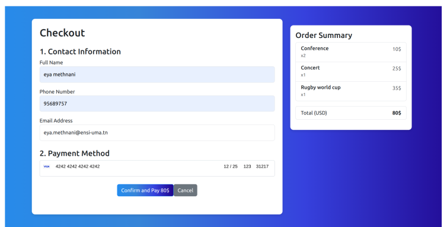
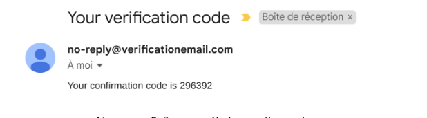
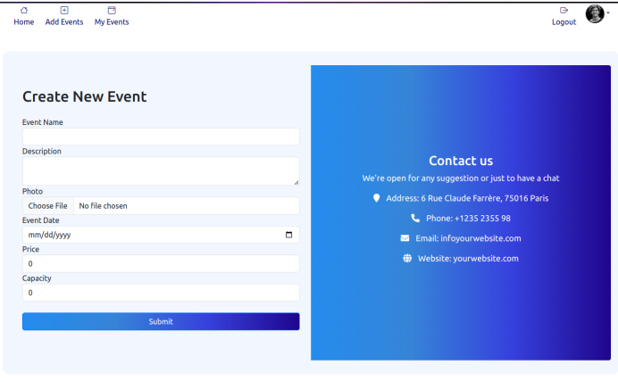
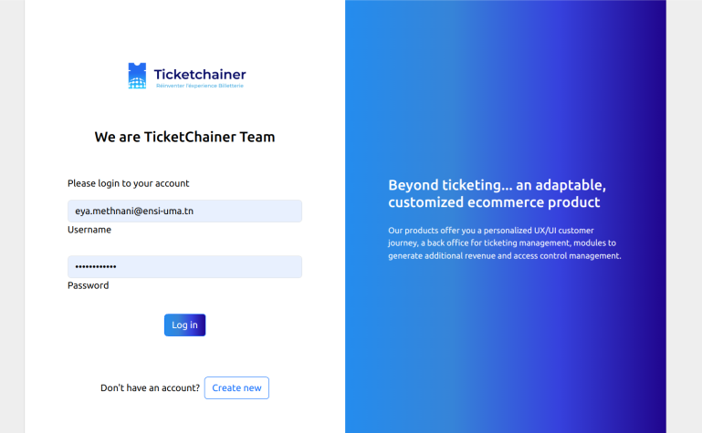
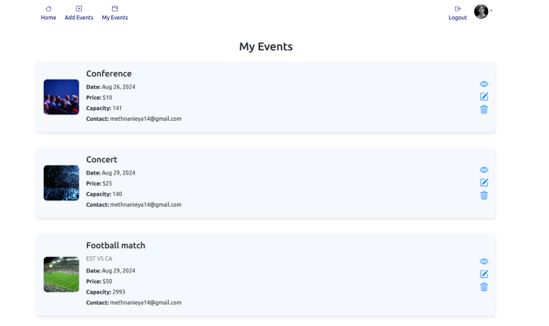
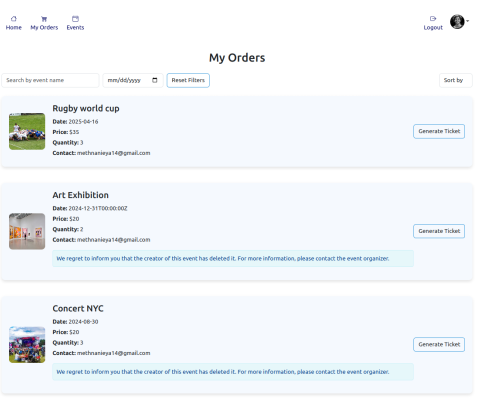
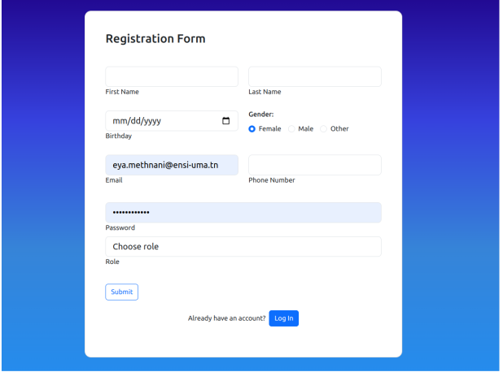
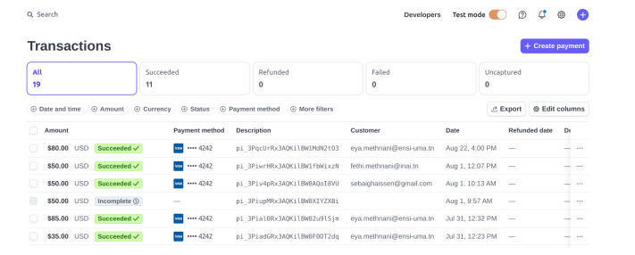
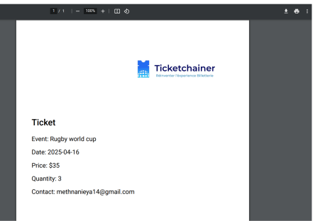
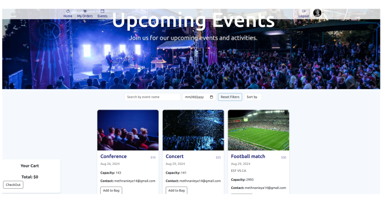

# TicketSales

TicketSales is a scalable, serverless web application designed for the online sale of event tickets. Developed as part of a summer internship project at TicketChainer, this application combines modern cloud infrastructure with an intuitive interface, allowing users to seamlessly create, manage, and purchase tickets for events. The project employs an end-to-end solution using AWS services, Angular, and Stripe, focusing on security, scalability, and a smooth user experience.

## Table of Contents

1. [Features](#features)
2. [Architecture](#architecture)
3. [Technology Stack](#technology-stack)
4. [Project Methodology](#project-methodology)
5. [Installation and Setup](#installation-and-setup)
6. [Usage](#usage)
7. [Screenshots](#screenshots)
8. [Future Enhancements](#future-enhancements)
9. [License](#license)

---

## Features

- **Event Management**: Event creators can register and log in to add, edit, and delete events, specifying details such as event name, description, date, and ticket pricing.
- **User Authentication and Role Management**: Secure user authentication and role-based access control with AWS Cognito, allowing different views and permissions for event creators and participants.
- **Ticket Purchase Process**: Participants can browse events, filter by date or name, and select events to purchase tickets. The ticketing system is integrated with Stripe to ensure secure, PCI-compliant transactions.
- **PDF Ticket Generation**: Upon successful purchase, tickets are generated in PDF format and securely stored on AWS S3 for easy access and download by participants.
- **Sales Dashboard for Event Creators**: Real-time sales tracking and statistical reports are available to event creators, providing insights into ticket sales and revenue trends.
- **Serverless Architecture**: Optimized for cost efficiency and scalability, utilizing AWS services that automatically scale based on demand.

---

## Architecture

TicketSales follows a three-tier, serverless architecture:

1. **Frontend (Presentation Layer)**: Built with Angular, the frontend is hosted on AWS S3, offering a dynamic and responsive UI for user interactions.
2. **API Layer (Business Logic)**: AWS API Gateway serves as the entry point for frontend requests, routing them to AWS Lambda functions for secure processing.
3. **Backend (Data and Storage Layer)**: AWS DynamoDB is used for NoSQL data storage, while AWS S3 stores static resources and generated ticket PDFs. Cognito handles user authentication, and Stripe manages payment processing.

The architecture’s serverless nature ensures scalability, reduced costs, and high availability, adapting to fluctuating workloads without manual server management.

### Key Services in the Architecture

- **AWS S3**: Hosts the Angular frontend and stores user tickets and other static files.
- **AWS API Gateway**: Manages RESTful endpoints, providing a secure gateway for API requests between the frontend and backend services.
- **AWS Lambda**: Executes backend functions on demand, handling everything from user management to ticket purchase processing.
- **AWS DynamoDB**: Stores event data, user information, and ticket details in a highly available and scalable NoSQL database.
- **AWS Cognito**: Authenticates users, provides session management, and allows for secure, role-based access control.
- **Stripe**: Facilitates secure payment processing, supports multiple payment methods, and provides a dashboard for transaction monitoring.

---

## Technology Stack

- **Frontend**: Angular, HTML, CSS, TypeScript
- **Backend**: Node.js for AWS Lambda functions
- **Cloud Services**: AWS (Cognito, Lambda, API Gateway, DynamoDB, S3)
- **Payment Integration**: Stripe for secure payment processing

---

## Project Methodology

The development of TicketSales followed Agile principles, specifically the Scrum framework, and was broken down into two primary phases over a period of two months:

### Learning Phase (Month 1)

- **Sprint 1**: Introduction to cloud computing and serverless architecture
- **Sprint 2**: API Gateway and Lambda configuration for core API endpoints
- **Sprint 3**: DynamoDB setup for event and user data management
- **Sprint 4**: Cognito integration for secure user authentication and S3 for file storage

### Implementation Phase (Month 2)

- **Sprint 5**: Design and setup of three-tier architecture with AWS
- **Sprints 6-7**: Development of user management, event management, and backend logic
- **Sprint 8**: Final testing, deployment, and feature polish for a production-ready application

---

## Installation and Setup

### Prerequisites

- Node.js and npm installed on your local machine.
- AWS account with permissions for Lambda, API Gateway, DynamoDB, Cognito, and S3.
- Stripe account for payment integration.

### Installation Steps

1. **Clone the Repository**:

   ```bash
   git clone https://github.com/yourusername/TicketSales.git
   cd TicketSales
   ```

2. **Install Dependencies**:

   ```bash
   npm install
   ```

3. **AWS Configuration**:
   - Set up AWS Lambda, DynamoDB, API Gateway, Cognito, and S3 using configuration files provided in `/config`.
   - Create an AWS Cognito user pool for authentication.
   - Set up S3 buckets for file storage (tickets and images) and frontend deployment.
   - Configure API Gateway to route requests to Lambda functions.

4. **Stripe Configuration**:
   - Add your Stripe API keys in the `.env` file or directly within the code where payments are processed.

5. **Run the Application**:

   ```bash
   ng serve
   ```

   The application will be accessible at `http://localhost:4200`.

---

## Usage

1. **Event Creators**: Register, log in, and create new events by providing event details, uploading images, and setting ticket prices.
2. **Participants**: Register, log in, browse available events, and purchase tickets.
3. **Admin Dashboard**: Event creators can view real-time sales data and manage events.

---

# Screenshots

1. **Cart Screen**  
   

2. **Checkout Screen**  
   

3. **Confirmation Mail**  
   

4. **Create Event Screen**  
   

5. **Earnings Screen**  
   

6. **Event Creator Homepage**  
   

7. **Login Screen**  
   

8. **My Events Screen**  
   

9. **Orders Screen**  
   

10. **Participant Navbar**  
    

11. **Registration Form**  
    

12. **Stripe Interface**  
    

13. **Generated Ticket**  
    

14. **Upcoming Events Screen**  
    

---

## Future Enhancements

- **Improved Analytics**: Adding more detailed reports on sales, demographics, and engagement for event creators.
- **Mobile App**: Developing a mobile application for iOS and Android for better accessibility.
- **Email and SMS Notifications**: Integrating notifications for ticket purchases, event updates, and reminders.
- **Advanced Ticket Management**: Implementing features for ticket transfers, refunds, and event cancellations.

---

## License

This project is licensed under the MIT License. See the [LICENSE](LICENSE) file for more information.

---
